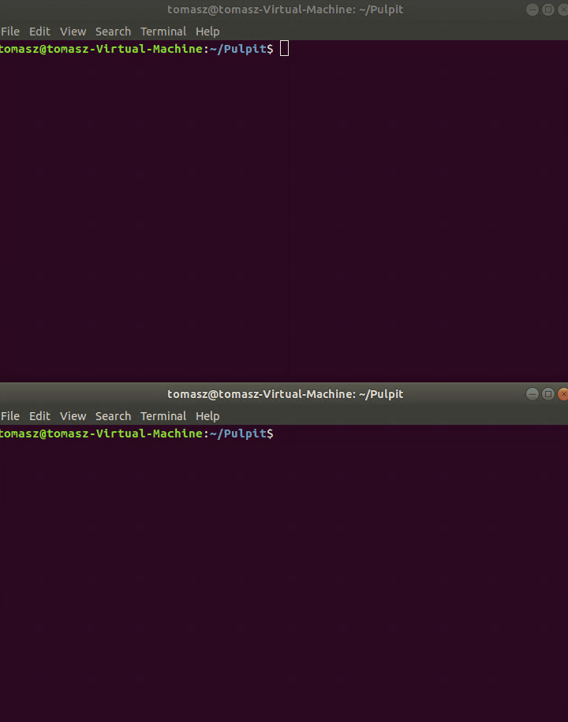

# Simple TCP UDP library

Simple TCP UDP library which allows you to create a TCP / UDP client and server.

# Getting started

These instructions will get you a copy of the project up and running on your local machine for development and testing purposes. 

### Prerequisites

What things you need to install the software and how to install them

```
GCC compiler
UNIX-family system (I've tested this solution on Ubuntu 18.04 LTS)
```

### Installing

A step by step series of examples that tell you how to get a development env running

1. Download the source code from [source](source) folder

2. Compile source files using make file as below:


3. Done


### Testing

After compilation of source code you can make a small test as below (example TCPserver.o uses port 9004 and TCPclient.o uses IP address: 127.0.0.1 and port 9004):




## License

This project is licensed under the MIT License - see the [LICENSE](LICENSE) file for details
